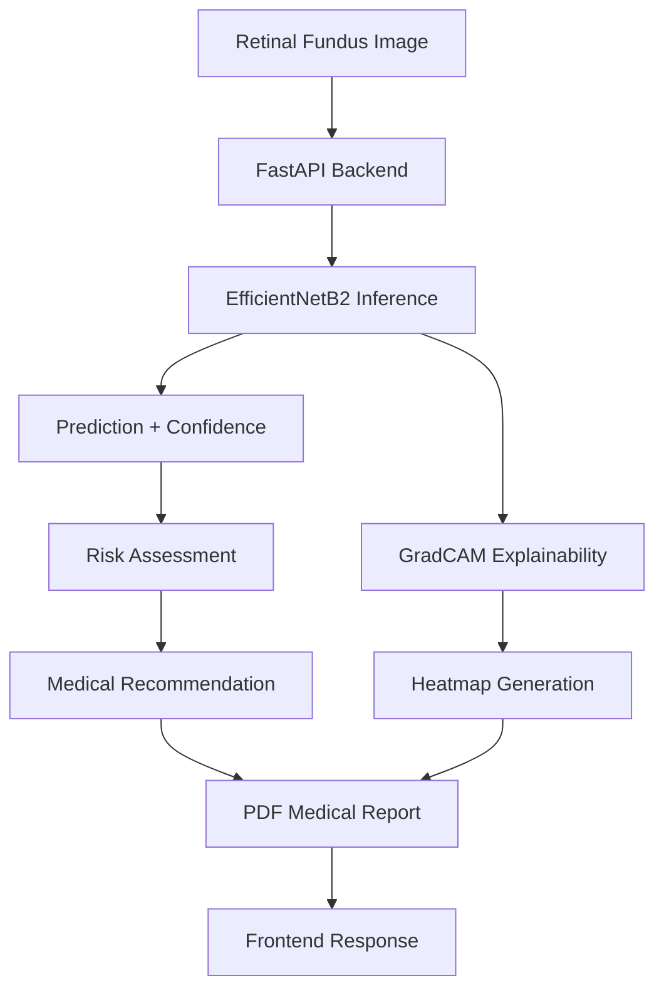
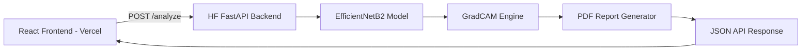
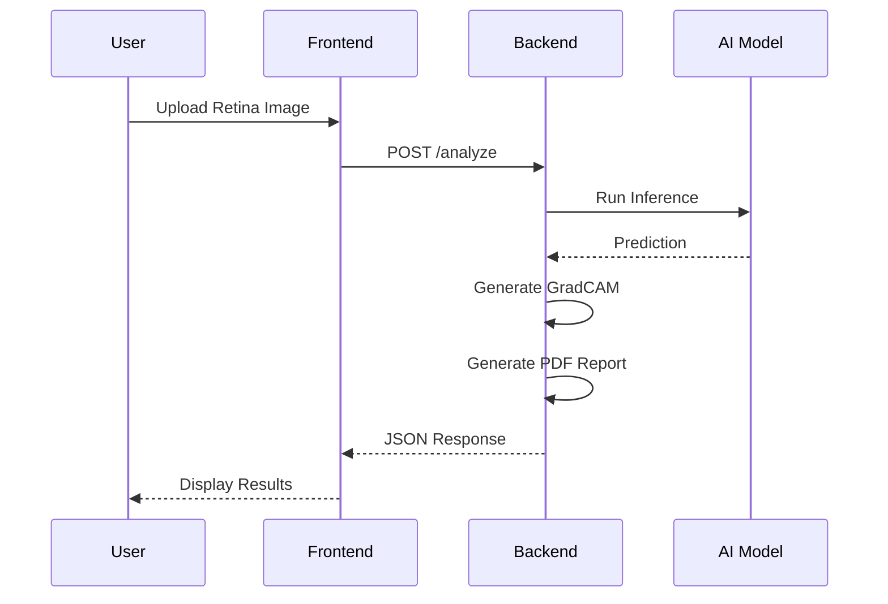

# 👁️ RetaniaScan-AI Backend

## AI-Powered Diabetic Retinopathy Detection Backend System

RetaniaScan-AI Backend is a production-style FastAPI backend for AI-powered diabetic retinopathy detection using EfficientNetB2, GradCAM explainability, and automated PDF medical report generation.

This backend is designed to power:
- React/Vercel frontend applications
- Medical AI dashboards
- AI-assisted retinal screening systems
- Research and educational deployments

---

# 🚀 Features

✅ FastAPI REST API Backend  
✅ EfficientNetB2 Retinal Classification  
✅ GradCAM Explainability Heatmaps  
✅ AI Confidence Scoring  
✅ Risk Level Assessment  
✅ Automated PDF Medical Reports  
✅ Dockerized Deployment  
✅ HuggingFace Spaces Ready  
✅ Frontend-Ready Structured JSON API  
✅ CORS Enabled for React/Vercel Integration  

---

# 🧠 Model Information

| Component | Details |
|---|---|
| Model | EfficientNetB2 |
| Task | Diabetic Retinopathy Classification |
| Classes | No DR, Mild DR, Moderate DR, Severe DR, Proliferative DR |
| Framework | PyTorch |
| Explainability | GradCAM |
| Backend | FastAPI |
| Deployment | HuggingFace Docker Space |

---

# 🏗️ System Architecture



---

# 🌐 Full Stack Architecture



---

# 📁 Project Structure

```text
hf-backend/
│
├── app/
│   ├── __init__.py
│   ├── config.py
│   ├── inference.py
│   ├── gradcam.py
│   ├── report_generator.py
│   ├── main.py
│   └── utils.py
│
├── models/
│   └── efficientnet/
│       └── best_efficientnet_b2.pth
│
├── outputs/
│   ├── heatmaps/
│   └── reports/
│
├── Dockerfile
├── .dockerignore
├── main.py
├── requirements.txt
└── README.md
```

---

# ⚙️ API Endpoints

## Health Check

### GET /

Returns backend status.

### Example Response

```json
{
  "message": "RetaniaScan-AI Backend Running"
}
```

---

# 🔍 Analyze Retina Endpoint

### POST /analyze

Analyze uploaded retinal fundus image.

---

## Request

### Form Data

| Field | Type |
|---|---|
| file | Image File |

Supported:
- PNG
- JPG
- JPEG

---

## Example Response

```json
{
  "prediction": "No DR",
  "confidence": "99.59%",
  "second_prediction": "Mild DR (0.18%)",
  "risk_level": "Low Risk",
  "confidence_status": "Prediction Confidence Acceptable",
  "recommendation": "Routine eye checkup recommended.",
  "heatmap_base64": "...",
  "pdf_report_path": "..."
}
```

---

# 📊 Explainability System

RetaniaScan-AI uses GradCAM for explainable AI visualization.

The heatmap highlights retinal regions that contributed most strongly to the model's prediction.

### Heatmap Color Meaning

| Color | Meaning |
|---|---|
| 🔴 Red | Highest influence |
| 🟠 Orange | Strong influence |
| 🟢 Green | Moderate influence |
| 🔵 Blue | Low influence |

---

# 📄 PDF Medical Reports

The backend automatically generates professional medical-style PDF reports containing:

- Retinal image
- DR prediction
- Confidence score
- Risk level
- GradCAM heatmap
- Medical recommendation
- Timestamp
- Disclaimer

---

# 🐳 Docker Deployment

## Build Docker Image

```bash
docker build -t retaniascan-backend .
```

---

## Run Docker Container

```bash
docker run -p 7860:7860 retaniascan-backend
```

---

# 🤗 HuggingFace Deployment

This backend is designed for deployment on HuggingFace Docker Spaces.

---

## Deployment Steps

### 1. Create HuggingFace Space

Select:
- SDK: Docker

---

### 2. Push Repository

```bash
git init
git add .
git commit -m "Initial HF backend deployment"
git branch -M main
git remote add origin YOUR_HF_REPO_URL
git push -u origin main
```

---

### 3. HF Automatically Builds Docker Image

The Dockerfile launches:

```bash
uvicorn main:app --host 0.0.0.0 --port 7860
```

---

# 💻 Local Development

## Install Dependencies

```bash
pip install -r requirements.txt
```

---

## Run Backend

```bash
uvicorn main:app --reload
```

---

## Open Swagger Docs

```text
http://127.0.0.1:8000/docs
```

---

# 🔐 CORS Support

CORS middleware is enabled to allow:
- React frontend
- Next.js frontend
- Vercel deployments

---

# 🧪 Example Workflow



---

# ⚠️ Disclaimer

This AI system is designed for:
- Educational purposes
- Research demonstrations
- AI-assisted retinal analysis

It is NOT a substitute for professional medical diagnosis.

Please consult qualified ophthalmologists for clinical evaluation and treatment.

---

# 🔮 Future Improvements

- React/Vercel Frontend
- User Authentication
- Patient History Dashboard
- Cloud Database Integration
- Multi-model Ensemble
- Retina Image Quality Assessment
- ONNX Optimization
- GPU Acceleration
- Multi-language Reports

---

# 👨‍💻 Developer

Developed by Mayank Kumar

RetaniaScan-AI — AI-Powered Retinal Screening System

---